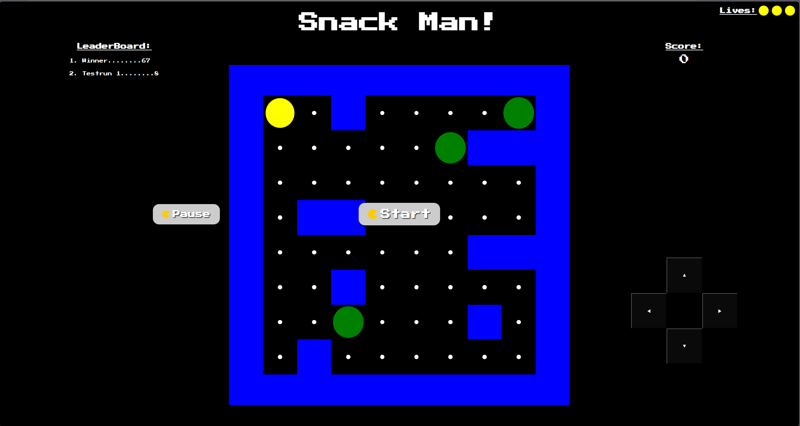

# Snack Man! - JavaScript Maze Game



**Snack Man!** is a retro-inspired browser-based maze game where players navigate a maze, collect points, avoid enemies, and compete for the highest score on the leaderboard.  

You can **play the game online** here: [Snack Man! on GitHub Pages](https://alamin-001.github.io/Javascript-Maze-Game/)

---

## Table of Contents

- [Features](#features)  
- [Gameplay](#gameplay)   
- [Controls](#controls)  
- [Customization](#customization)  
- [License](#license)
- [Installation](#installation) 

---

## Features

- Fully playable in any modern web browser.  
- 10x10 maze grid with walls, points, enemies, and a player character.  
- Enemy AI moves randomly within the maze.  
- Lives system (3 lives per game).  
- Score tracking with a local leaderboard (top 5 scores saved in browser storage).  
- Pause, resume, start, and restart functionality.  
- Dynamic difficulty: more enemies and faster speeds as you collect all points.  
- Visual effects: hit animation, death animation, and player “mouth” animation.  

---

## Gameplay

1. Press **Start** to begin the game.  
2. Collect all white points while avoiding green enemies.  
3. Colliding with an enemy reduces your lives.  
4. The game ends when all lives are lost.  
5. Enter your name to save your score in the leaderboard.  
6. Collecting all points increases difficulty by adding enemies and increasing speed.  

---

## Controls

- Keyboard: Arrow keys to move.

- On-Screen Buttons: ⬆️⬇️⬅️➡️ .

- Game Buttons: Start, Pause, Resume, Restart.

---

## Customization

- Modify the maze array in script.js for custom layouts.

- Adjust CSS in styles.css to change visuals.

- Change difficulty using enemyAmount and enemySpeed.

---
## Installation

1. Clone or download the repository:

```bash
git clone https://github.com/alamin-001/Javascript-Maze-Game.git


